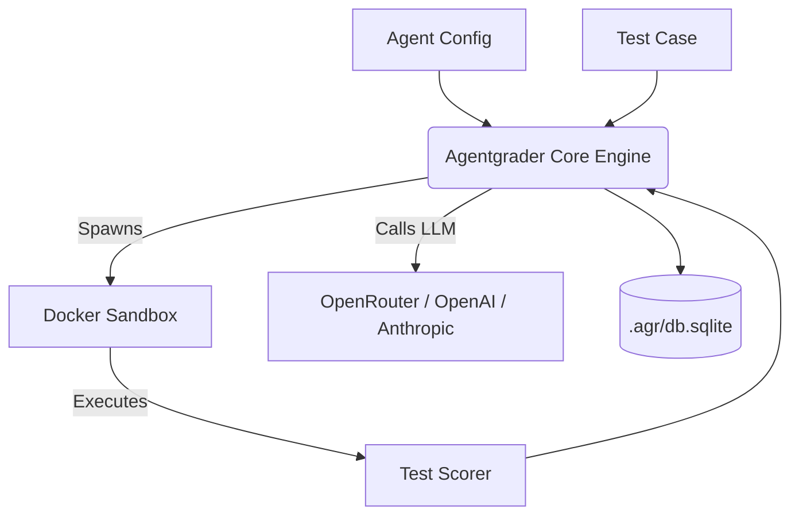

# What is Agentgrader?

**Agentgrader** is an open-source framework for benchmarking AI coding agents. Run agents against real programming test cases inside isolated Docker sandboxes, score results objectively, and track cost, token usage, and pass rates over time.

Install it from npm: no repository clone required:

```bash
npm install -g agentgrader
```

The core idea: you have a coding agent (GPT-4o, Claude, Gemini, or your own implementation) and you want to know objectively how good it is on real tasks. Agentgrader provides the infrastructure to find out.

## Key features

- **Language-agnostic test cases:** Any language that runs in Docker: TypeScript, Python, Rust, Go, and more.
- **Real execution:** Agents run commands and edit files in a Docker container. No mocks.
- **Automated scoring:** Pass and fail are determined by running real test suites (`npm test`, `pytest`, etc.) and optional per-test regression checks.
- **Budget tracking:** Every run records tokens consumed and USD cost per model.
- **Pluggable adapters:** Swap the LLM adapter, sandbox provider, or scorers without changing core logic.
- **Node and Bun:** Runs on Node.js 18+ or [Bun](https://bun.sh/). Results persist in a local SQLite database.

## Architecture overview



You define agent configs and test cases. Agentgrader iterates through evaluations, giving each agent an isolated sandbox to run commands and edit code. When the agent finishes, validation runs inside the container and results are stored in `.agr/db.sqlite`.

## Get started

Follow the [Quickstart](/guide/quickstart) to install the CLI and run your first evaluation in minutes.
