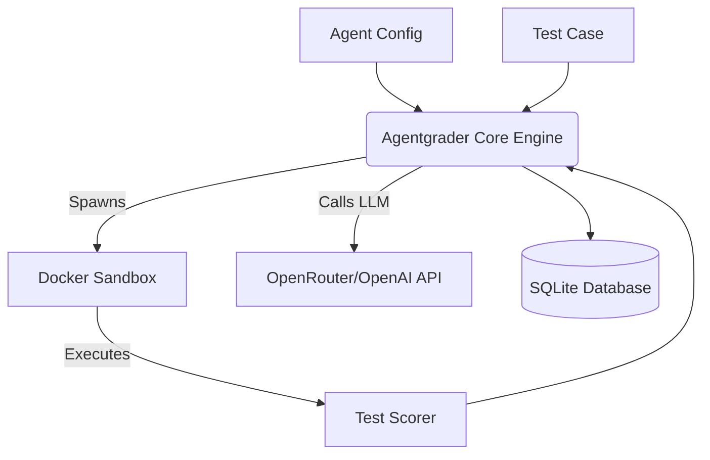

# What is Agentgrader?

Welcome to **Agentgrader**. This is an open-source benchmarking framework specifically built for TypeScript and Bun/Node projects. 

Think of it as a testing ground for your AI coding agents. It gives you the power to run your agents against real programming tasks inside completely isolated Docker sandboxes. Once the agent is done, Agentgrader automatically scores its work and tracks important metrics like cost, token usage, and pass rates over time.

The core idea is simple. You have a coding agent powered by a model like GPT-4o, Claude, or Gemini, and you want to know objectively how good it actually is. Agentgrader provides you with all the infrastructure you need to find out.

## Key Features

*   **Language-agnostic tasks:** You can work with any language that runs in Docker, including TypeScript, Python, Rust, and Go.
*   **Real execution:** The agent actually runs commands and edits files within a Docker container. There is no mocking involved.
*   **Automated scoring:** Pass and fail states are determined by running real test suites like `npm test` or `pytest`.
*   **Budget tracking:** Every single run keeps track of the tokens consumed and the USD cost per model.
*   **Pluggable adapters:** You can easily swap out the LLM, the sandbox, or the scorer without needing to touch any core logic.
*   **Node & Bun Support:** The framework runs effortlessly on standard Node.js environments as well as [Bun](https://bun.sh), utilizing `better-sqlite3` for an incredibly fast local database.

## Architecture Overview

Agentgrader seamlessly connects your agent configuration, task definitions, and execution environments.

You start by defining a baseline agent and a suite of test cases. Agentgrader then iterates through these cases, giving the agent an isolated sandbox where it can run commands, edit code, and attempt to fix the problem. Once the agent finishes, the framework executes validation commands right inside the container to see if the task was successfully completed, and everything is safely recorded in your database.
