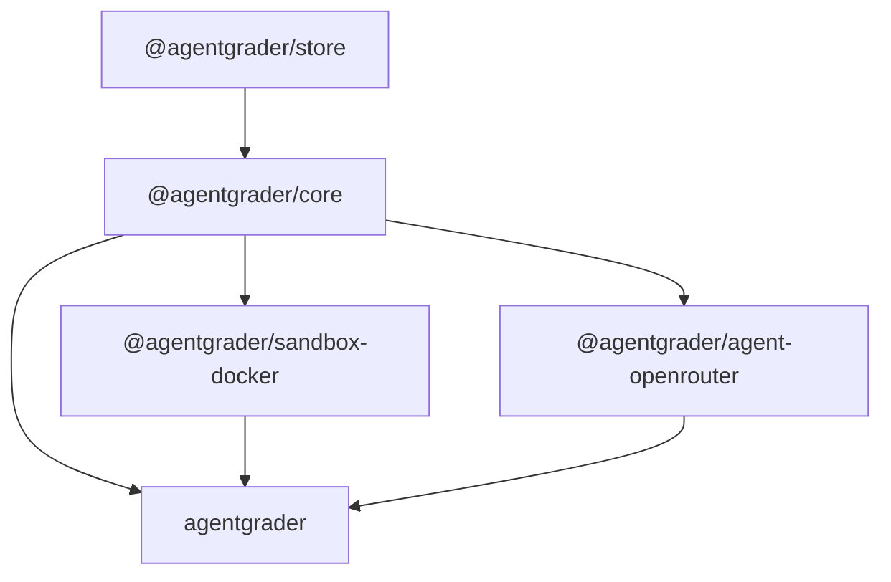

# Packages Architecture

The Agentgrader framework is built as a Turborepo monorepo. It contains five interdependent packages that all live neatly under the `packages/` directory.

## Architecture Diagram

The dependencies flow upward from the store all the way to the CLI:

## Packages Overview

### `@agentgrader/store`
This is the SQLite persistence layer. It is built using Drizzle ORM and `better-sqlite3`. This package handles all your run records, calculates costs, and tracks telemetry.

### `@agentgrader/core`
Think of this as the core engine. It defines the central interfaces, runner abstractions, schemas, and the scoring logic like CommandScorer and AssertionScorer. Naturally, it depends on the `store` package.

### `@agentgrader/sandbox-docker`
This is our default Sandbox Provider that utilizes local Docker containers. It expertly manages the lifecycle of spinning up isolated execution environments, copying over fixture directories, and orchestrating shell execution. It depends on `core`.

### `@agentgrader/agent-openrouter`
This is the adapter for OpenRouter and OpenAI. It evaluates tasks using standard large language models by bridging the Agentgrader agent interfaces directly to the OpenRouter and OpenAI APIs. It depends on `core`.

### `agentgrader` (CLI)
This is the main CLI binary known as `agr`. It uses Ink to build a fantastic terminal dashboard and handles commands like `bench` and `run`. Because it is the top layer, it depends on all the other packages.
